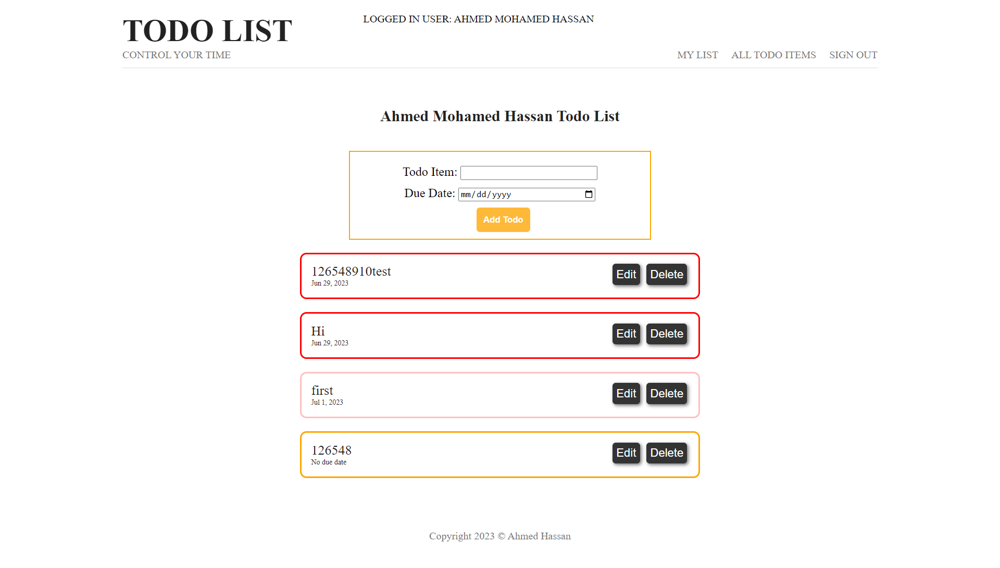
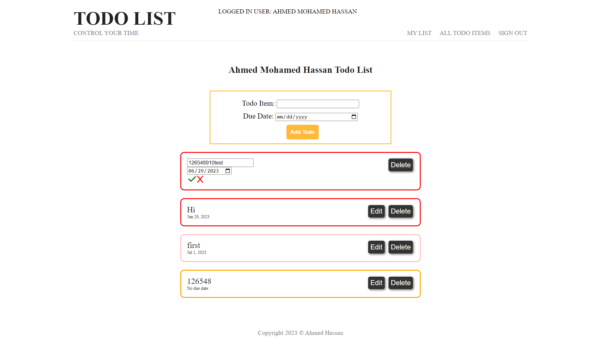
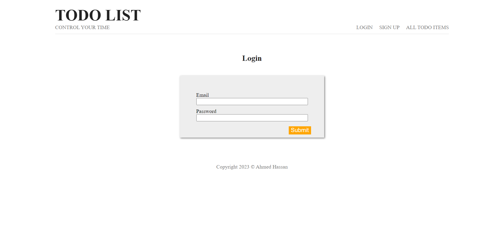
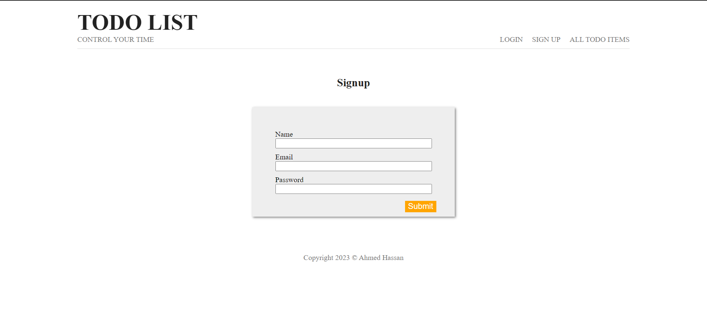
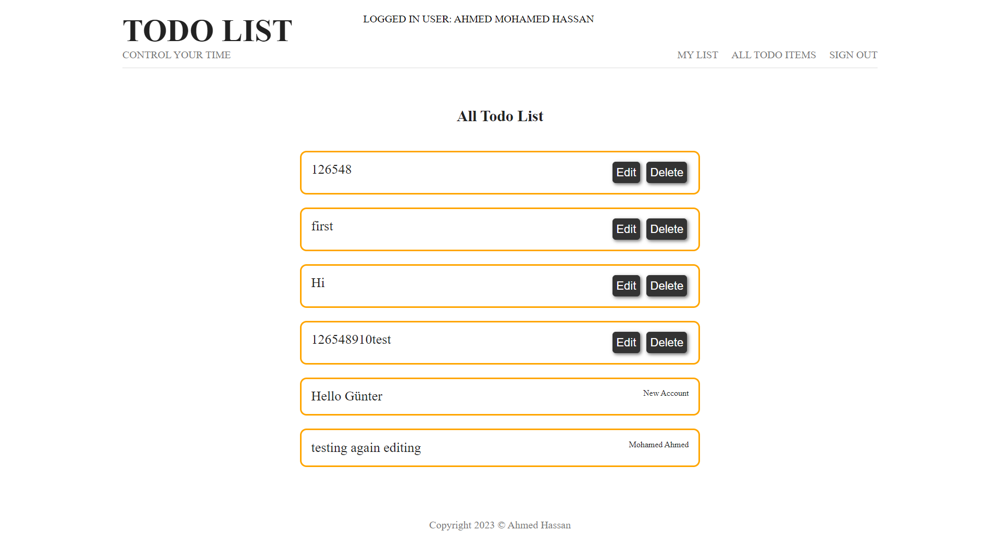

# Todo App Project

## Preview

## Table of Contents

* [Description](#description)
* [Installation](#installation)
* [Usage](#usage)
* [Development](#development)
* [Contribute](#contribute)

## Description
Todo List is a powerful and user-friendly todo application designed to help you stay organized, focused, and in control of your tasks and responsibilities. With a sleek and intuitive interface, Todo List offers a comprehensive set of features to streamline your productivity. Let's explore its key functionalities:

1. Seamless Login and Signup:
Todo List ensures a secure and hassle-free experience by providing a seamless login and signup process. Create your personalized account or easily log in with your existing credentials to access your todos anytime, anywhere.

2. Add Todo:
Effortlessly capture your tasks and to-do items with the "Add Todo" feature. Simply enter the task title and set a due date. With just a few taps, your tasks will be efficiently recorded, ready for you to tackle.

3. Edit Todo:
Todo List empowers you to adapt to changing circumstances with ease. Edit your todos effortlessly to update task details, or modify due dates. Stay flexible and keep your tasks aligned with your evolving needs.

4. Delete Todo:
No longer need a task? Todo List allows you to swiftly remove unwanted todos from your list. With a simple swipe or click, you can delete completed or irrelevant tasks, keeping your workspace clutter-free and focused on what matters most.

5. View All Todos:
Effortlessly stay on top of your tasks with the "View All Todos" feature. Todo List provides a clear and comprehensive overview of all todos in a single place. Instantly access and review others tasks, ensuring nothing slips through the cracks.

## Installation
1. Open your terminal and run the following command 
`git clone https://github.com/AhmedMohammed3/Todo-App.git`
2. Install the necessary dependencies to run the web application by running 
 `npm install`
3. Create a .env file inside `Todo_App` directory like the provided [.env.example](.env.example ".env.example")
## Usage
1. Open your terminal inside the `Todo_App` Directory
2. Start the local server by running 
`npm start` or `npm run dev`
## Screenshots
- Main Page:

- Edit Action:

- Login Page:

- Sign Up Page:

- All Todos Page:

## Contribute
### Adding new features or fixing bugs
1. Open your terminal and clone the repository 
     `git clone https://github.com/AhmedMohammed3/Todo-App.git`
2. Create your branch 
      `git checkout -b {YOUR_BRANCH_NAME}`
3. Make your edits and review it well.
4. Commit your changes with appropriate message. Follow [these git style guides](https://udacity.github.io/git-styleguide/) 
      `git checkout -b {YOUR_BRANCH_NAME}`
5. Push your changes 
      `git push origin {YOUR_BRANCH_NAME}`
6. Create a merge request